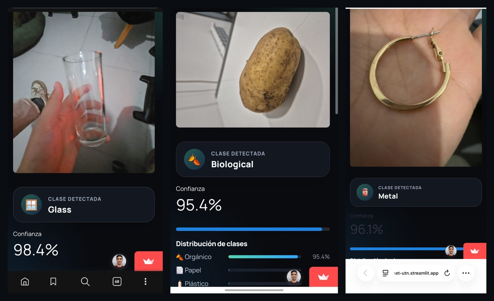
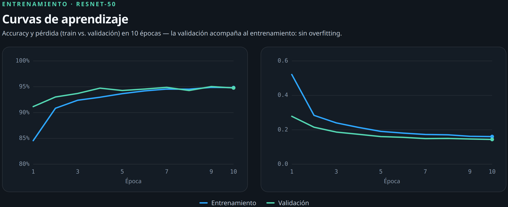
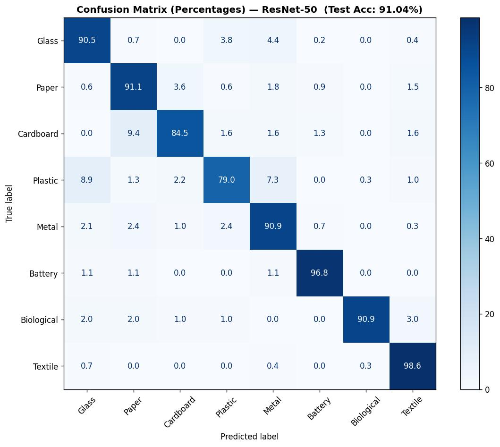
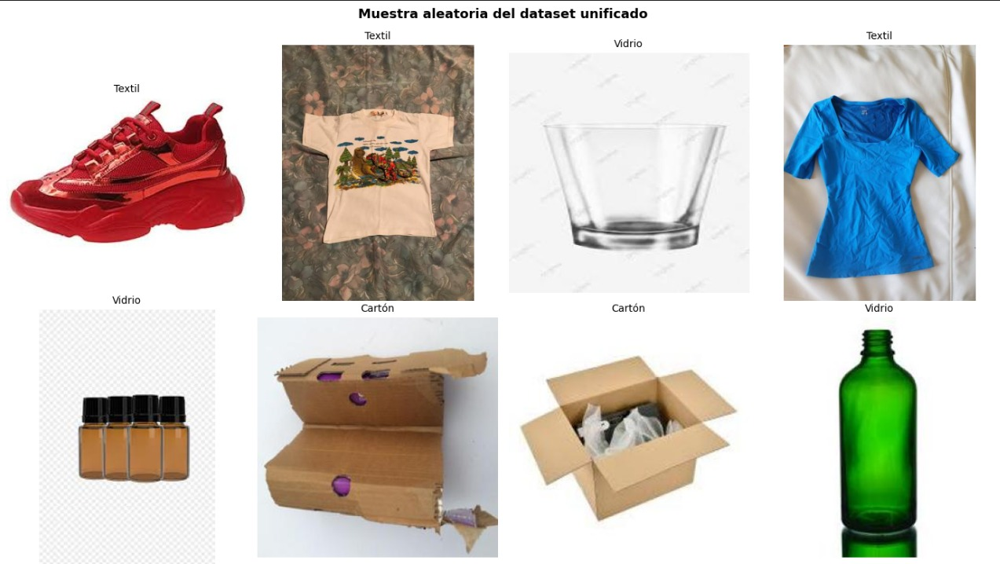
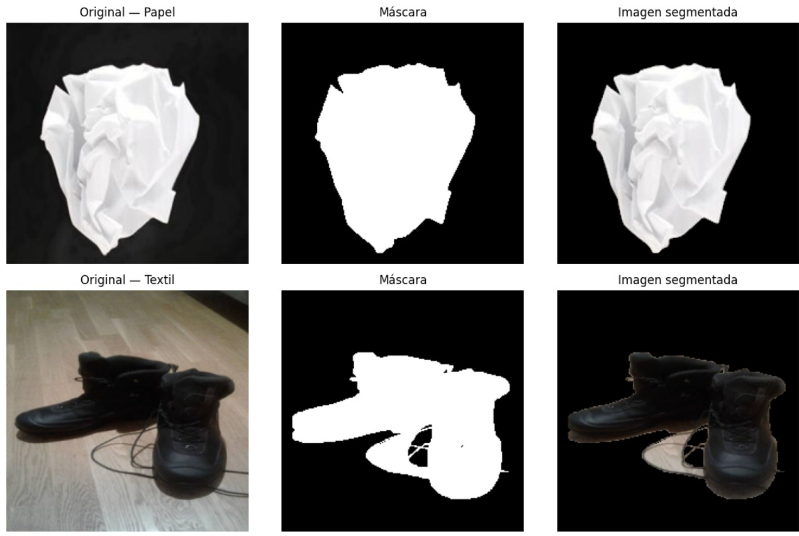

<div align="center">

# ♻️ RecycleNet

### Urban waste classification with Deep Learning and Computer Vision

[](https://www.python.org/)
[](https://pytorch.org/)
[](https://streamlit.io/)
[](https://opencv.org/)
[](LICENSE)
[](https://www.linkedin.com/posts/carlosgitto_recyclenet-transfer-learning-for-waste-classification-ugcPost-7477751611960979456-i_dr/)

**Up to 95% accuracy · 8 classes · 26,219 images · transfer learning + live app**
[](https://recyclenet-utn.streamlit.app/)

[🚀 Try the live demo](https://recyclenet-utn.streamlit.app/) · [📝 LinkedIn write-up](https://www.linkedin.com/posts/carlosgitto_recyclenet-transfer-learning-for-waste-classification-ugcPost-7477751611960979456-i_dr/) · [📓 Notebooks](dev/)

</div>

> A computer-vision system that identifies the type of waste from a single photo,
> making recycling simpler and more effective. Research capstone project for the course
> **Deep Neural Networks** — Information Systems Engineering, **UTN — Mendoza Regional Faculty (Argentina)**.

<p align="center"></p>

---

## ✨ TL;DR

- **8 waste classes:** glass, paper, cardboard, plastic, metal, battery, biological and textile.
- **Custom unified dataset** built from 2 public Kaggle datasets → **26,219 images**.
- **6-experiment benchmark** (3 architectures × 2 preprocessing variants) via **transfer learning**.
- **Counterintuitive finding:** segmenting the object from its background **hurt** the model across every architecture.
- **Best experiment:** ResNet-50 (no segmentation) — **95.46% test accuracy** (10-epoch benchmark).
- **Deployed model:** ResNet-50 retrained for 20 epochs — **91.04% accuracy · 0.90 macro-F1** (powers the live demo).
- **Final product:** interactive web app built with **Streamlit**, multilingual (ES / EN / PT).

---

## 📊 Results

We compared **3 pretrained architectures × 2 variants** (with and without GrabCut segmentation),
under the same protocol for all of them (same splits, Adam, 10 epochs, fixed seed):

| Architecture      | Segmentation | Val Acc | **Test Acc** | Test Loss |
|-------------------|:------------:|:-------:|:------------:|:---------:|
| **ResNet-50**     |    ❌ No      | 95.04%  | **95.46%**   | 0.151     |
| EfficientNet-B0   |    ❌ No      | 91.19%  | 91.11%       | 0.265     |
| ResNet-18         |    ❌ No      | 88.63%  | 88.18%       | 0.334     |
| ResNet-50         |    ✅ Yes     | 84.44%  | 82.38%       | 0.511     |
| EfficientNet-B0   |    ✅ Yes     | 80.17%  | 80.47%       | 0.599     |
| ResNet-18         |    ✅ Yes     | 79.75%  | 78.49%       | 0.606     |

<table>
<tr>
<td width="50%"></td>
<td width="50%"></td>
</tr>
</table>

> 🔎 **Key finding.** We expected that isolating the waste object from its background would help, but
> GrabCut segmentation **degraded performance by 9 to 13 points** across all three architectures. The intuition:
> a network pretrained on ImageNet leverages scene context as signal, and cropping it out with an imperfect
> mask removes information instead of cleaning it. **More preprocessing isn't always better.**

---

## 🧠 Methodology

End-to-end pipeline, from raw data to a deployed model:

| # | Stage | Detail |
|---|-------|--------|
| 1 | **Loading & unification** | Mapping 2 Kaggle datasets into 8 common classes with a PyTorch `Dataset` class |
| 2 | **Class-balance analysis** | Per-class counts; ~7.7× imbalance → decision to stratify |
| 3 | **Stratified split** | Train 80% / Val 10% / Test 10% (seed 42, versioned CSVs) |
| 4 | **Segmentation (GrabCut)** | Variant that isolates the object; precomputed to disk with multiprocessing |
| 5 | **Data augmentation** | Flip, rotation and color jitter on train; ImageNet normalization on every split |
| 6 | **Transfer learning** | Frozen backbone + new 8-class head; `CrossEntropyLoss`, Adam, `StepLR` |

<table>
<tr>
<td width="50%"></td>
<td width="50%"></td>
</tr>
</table>


**Final model.** The winning configuration (ResNet-50, no segmentation) It reaches 91.04% accuracy and 0.90 macro-F1 on the test set — this is the model 
behind the live demo and the confusion matrix above. Model selection is based on best validation accuracy (not the last epoch) and reported with 
accuracy + per-class F1 + confusion matrix.

---

## 🖥️ The application

The model didn't stay in a notebook: it was wrapped into an interactive app with **Streamlit**.

- 📷 Classification via **image upload or camera**, with confidence score and class distribution.
- 🌎 **Multilingual** interface (Spanish, English, Portuguese).
- 🗂️ **Configurable class grouping** to match the local recycling system.
- 💡 **Recycling tips** per material.

```bash
cd prod
pip install -r requirements.txt
streamlit run app.py
```

---

## 🚀 Reproduce from scratch

```bash
# 1 · Clone
git clone https://github.com/NachoBerridy/recyclenet.git
cd recyclenet

# 2 · Environment + dependencies
python scripts/setup_environment.py
source .venv/bin/activate          # Windows: .venv\Scripts\activate

# 3 · Download the Kaggle datasets
python scripts/download_dataset.py

# 4 · Run the pipeline (in order)
jupyter notebook dev/01_dataset_preparation.ipynb
#   → dev/02_model_training_experiments.ipynb
#   → dev/03_resnet50_final_training.ipynb

# 5 · Run the app
streamlit run prod/app.py
```

A fixed seed (`SEED = 42`) and versioned CSVs (`data/`) guarantee that the whole team
trains on exactly the same partition.

---

## 📁 Structure

```text
recyclenet/
├── data/                 # Versioned splits (train/val/test.csv) + experiment results
├── dev/                  # Research notebooks
│   ├── 01_dataset_preparation.ipynb
│   ├── 02_model_training_experiments.ipynb
│   └── 03_resnet50_final_training.ipynb
├── prod/                 # Application + trained model
│   ├── app.py            # Streamlit app
│   ├── utils.py          # Model loading and inference
│   └── model.pth         # Trained ResNet-50 checkpoint
├── scripts/              # Environment setup and data download
├── assets/               # README images
└── requirements.txt
```

---

## 🛠️ Stack

`Python` · `PyTorch` · `torchvision` · `OpenCV` · `scikit-learn` · `NumPy` · `pandas` · `Matplotlib` · `Streamlit` · `Jupyter` · `Google Colab`

---

## 👥 Team

| | |
|---|---|
| **Antonella Aldao** | [GitHub](https://github.com/AntoAldao) · [LinkedIn](https://ar.linkedin.com/in/antonellaaldao) |
| **Ignacio Berridy** | [GitHub](https://github.com/NachoBerridy) · [LinkedIn](https://ar.linkedin.com/in/ignacioberridy) |
| **Carlos Gitto** | [GitHub](https://github.com/CarlosGitto) · [LinkedIn](https://ar.linkedin.com/in/carlosgitto) |
| **Diandra Malca** | [GitHub](https://github.com/DiandraMalca) · [LinkedIn](https://www.linkedin.com/in/diandra-malca-8099791b3/) |
| **Ignacio Ramos** | [GitHub](https://github.com/IgnacioGRamos) · [LinkedIn](https://www.linkedin.com/in/ignacio-ramos-developer/) |

---

## 📚 Datasets

- [Garbage Dataset Classification](https://www.kaggle.com/datasets/zlatan599/garbage-dataset-classification) (Kaggle)
- [Garbage Classification](https://www.kaggle.com/datasets/mostafaabla/garbage-classification) (Kaggle)

## 📜 License

Released under the [MIT](LICENSE) license. Academic project developed for educational purposes
for the **Deep Neural Networks** course — UTN-FRM.
